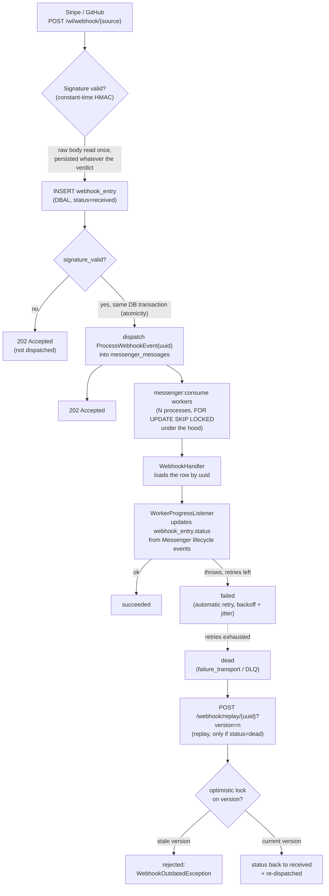

# Webhook Ledger

[](https://www.php.net/)
[](https://symfony.com/)
[](https://www.clever-cloud.com/)

A small Symfony service that receives webhooks (Stripe, GitHub), persists them **before**
acknowledging, deduplicates by `(source, external_event_id)`, dispatches processing with retry
and a dead-letter queue, and lets you replay a dead event without reprocessing it twice.

## Table of contents

- [Live instance (demo)](#live-instance-demo)
- [Reusable bundle](#reusable-bundle)
- [Why](#why)
- [The flow](#the-flow)
- [Stack](#stack)
- [Running it locally](#running-it-locally)
- [Endpoints](#endpoints)
- [Decisions](#decisions)
- [Concurrency proof](#concurrency-proof)
- [Scope](#scope)

## Live instance (demo)

- Live demo available [here](https://app-db2e6f52-cf54-424d-b954-935fb2975e52.cleverapps.io)

Since this is just a demo project, you can bypass the Basic Auth with the following credentials:

- user: `demo`
- password: `OddMeEvenYou`

## Reusable bundle

This project only serves to demonstrate how you can use [the webhook-ledger-bundle](https://github.com/adaniloff/webhook-ledger-bundle).
A lot of concepts documented here actually belong to that bundle.

## Why

Since discovering the `Dual Write` issue, I've wanted to set up a boilerplate for Symfony-like
projects. The main goal was to see which existing components I'd pick, and how I could simplify
or (eventually) rework the pattern for a Symfony application.

See [Concurrency proof](#concurrency-proof) for how that's tested, and [Decisions](#decisions)
for some explanations, issues I've encountered, trade-offs I've chosen to take.

<details>
<summary><strong>About AI usage</strong></summary>

I've had *Claude* assist me code minor chores like:
- (test) setting up the concurrency test scripts.
- (test) building a set of fixtures.
- (arch) quicken the Github/Stripe signature ascertainment.
- (chores) generating part of this README.

I wanted not to overuse it, as the goal was, like I said, to explore by myself.

</details>

## The flow

<details open>
<summary>Mermaid diagram</summary>



</details>

Only the UUID travels to the queue. The database row *stays* the single source of truth.

## Stack

- PHP 8.2-FPM
- Symfony 7.4 + Doctrine ORM/DBAL + Messenger + PHPUnit
- Caddy (reverse proxy)
- MariaDB 10.11
- Deployed on [Clever Cloud](https://www.clever-cloud.com/) (git push deploy, migrations run in `clevercloud/pre_run_hook.sh` before each restart)

## Running it locally

```bash
just install     # build + start the docker stack, install dependencies
just du          # start the stack (alias for docker-up)
just console d:m:m --no-interaction  # run migrations
just test        # PHPUnit
just stan        # PHPStan, level max
just cs fix      # php-cs-fixer
```

`GITHUB_WEBHOOK_SECRET` and `STRIPE_WEBHOOK_SECRET` are read from the `.env.local` file.
Signing a request by hand for local testing:

```bash
BODY='{"hello":"world"}'
SIG=$(php -r 'echo hash_hmac("sha256", $argv[1], "your-local-secret");' "$BODY")
curl -X POST http://localhost:8080/wl/webhook/github \
    -H "X-GitHub-Delivery: test-1" \
    -H "X-Hub-Signature-256: sha256=$SIG" \
    --data-raw "$BODY"
```

## Endpoints

| Method | Path                          | Description                                            |
|--------|-------------------------------|----------------------------------------------------------|
| POST   | `/wl/webhook/{source}`                   | Receive a webhook. `source` is `stripe` or `github`.    |
| POST   | `/webhook/replay/{uuid}?version=n`       | Replay a `dead` webhook, guarded by **optimistic locking**.  |
| GET    | `/`                                      | Dashboard: list of webhooks + replay button on dead ones.    |
| GET    | `/health`                                | 204 if the database connection is up, 503 otherwise.     |

## Decisions

- **Retry with exponential backoff and jitter, dead-letter on exhaustion.** See `config/packages/messenger.yaml`.
Why the jitter? Without it, a burst of failures all retry in lockstep and hit the
downstream dependency at the same instant.

- **Constant-time signature verification, per source.** An invalid signature still gets persisted
(`signature_valid = false`) as intel (and returns `401`), but is never dispatched to a worker.

## Concurrency proof

Three scenarios, driven by shell scripts (`xargs -P`, no load-testing tool needed), run against
the live stack:

- **N parallel requests, same `external_event_id`** → exactly one row in `webhook_entry`
  (`bin/concurrency-test-dedup.sh`).
- **Two workers consuming the same queue** → no event handled twice
  (`bin/concurrency-test-workers.sh`).
- **Two simultaneous replays of the same event** → one succeeds, the other gets an
  `OptimisticLockException` (`bin/concurrency-test-replay.sh`).

Run them all with `just ccrc` (**disclosure**: *it'll reset your local database state*).

They run in CI on every push to `main`, after the main test job.

## Scope

<details>
<summary><strong>Known limitations</strong> - deliberately out of scope for this iteration, not forgotten</summary>

- No CSRF protection on the replay form -> not the point of this demo.
- Basic Auth, not per-user auth -> not the point of this demo (again).
- No payload transformation, subscription filtering, or multi-destination fan-out.
- No provider other than Stripe and GitHub.
- No multi-tenancy.
- No automatic data purge.

</details>

<details>
<summary><strong>Improvements</strong> (todo-list)</summary>

- Reworking the frontend as a React or VueJS SPA.

</details>
